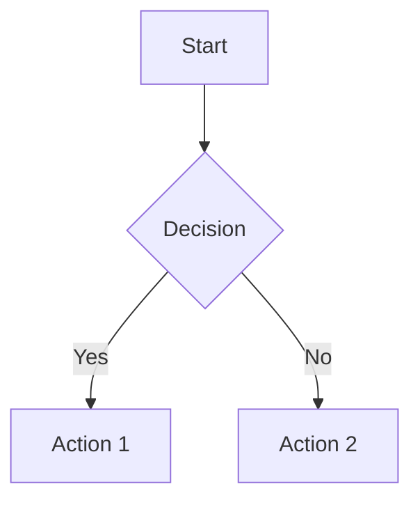

# Bambans Personal Website & Blog

A modern, accessible, and performant personal website with an integrated blog system. Built with vanilla JavaScript, Bootstrap, and optimized for excellent user experience across all devices.

## 🚀 Features

### Main Website
- **Clean Design**: Minimalist card-based layout with terminal-inspired aesthetics
- **Fully Responsive**: Optimized for mobile, tablet, and desktop
- **Accessibility First**: WCAG 2.1 AA compliant with screen reader support
- **Performance Optimized**: Fast loading with resource preloading and caching

### Blog System
- **GitHub Integration**: Posts stored as Markdown files in GitHub repository
- **Mermaid Charts**: Full support for diagrams and flowcharts
- **Syntax Highlighting**: Code blocks with Prism.js
- **Markdown Rendering**: Complete markdown support with frontmatter metadata
- **Responsive Sidebar**: Easy navigation between posts
- **SEO Friendly**: Proper meta tags and semantic HTML

## 📁 Project Structure

```
bambans.github.io/
├── css/
│   ├── normalize.css      # CSS reset for consistency
│   └── main.css          # Shared styles with CSS variables
├── js/
│   └── main.js           # Main page functionality
├── blog/
│   ├── css/
│   │   └── blog.css      # Blog-specific styles
│   ├── js/
│   │   ├── markdown-renderer.js  # Markdown processing
│   │   ├── mermaid-handler.js    # Chart rendering
│   │   └── blog-app.js          # Main blog application
│   ├── posts/            # Markdown blog posts
│   └── index.html        # Blog landing page
├── img/                  # Images and assets
├── index.html           # Main landing page
└── README.md           # This file
```

## 🛠 Technology Stack

### Frontend
- **HTML5**: Semantic markup with accessibility features
- **CSS3**: Modern CSS with custom properties and responsive design
- **JavaScript ES6+**: Modular, vanilla JavaScript
- **Bootstrap 5.3.6**: Responsive grid and utilities

### External Libraries
- **Marked.js**: Markdown parsing
- **Prism.js**: Syntax highlighting
- **Mermaid.js**: Diagram and chart rendering
- **DOMPurify**: HTML sanitization

### Development
- **GitHub Pages**: Static site hosting
- **GitHub API**: Dynamic blog post loading
- **Service Worker**: (Optional) Offline capabilities

## 🚀 Getting Started

### Prerequisites
- Web server (for local development)
- Modern web browser
- Git (for cloning)

### Local Development

1. **Clone the repository**
   ```bash
   git clone https://github.com/bambans/bambans.github.io.git
   cd bambans.github.io
   ```

2. **Serve locally**
   ```bash
   # Using Python
   python -m http.server 8000
   
   # Using Node.js
   npx serve .
   
   # Using PHP
   php -S localhost:8000
   ```

3. **Open in browser**
   ```
   http://localhost:8000
   ```

### Adding Blog Posts

1. **Create markdown file** in `blog/posts/`
2. **Add frontmatter** (optional):
   ```markdown
   ---
   title: "Your Post Title"
   author: "Your Name"
   date: "2023-12-01"
   tags: "tag1, tag2, tag3"
   ---
   
   Your content here...
   ```

3. **Commit and push** - the blog will automatically update

## 🎨 Customization

### Color Scheme
Edit CSS custom properties in `css/main.css`:

```css
:root {
    --bg-primary: #121212;
    --bg-secondary: #1e1e1e;
    --accent-primary: #40e0d0;
    --accent-secondary: #ff6347;
    /* ... more variables */
}
```

### Blog Configuration
Modify settings in `blog/js/blog-app.js`:

```javascript
this.config = {
    github: {
        username: 'your-username',
        repo: 'your-repo',
        postsPath: 'blog/posts'
    }
    // ... more config
};
```

## ♿ Accessibility Features

- **Keyboard Navigation**: Full keyboard support
- **Screen Reader Support**: ARIA labels and semantic HTML
- **Focus Management**: Logical tab order and focus indicators
- **Color Contrast**: WCAG AA compliant contrast ratios
- **Reduced Motion**: Respects user preferences
- **Skip Links**: Easy navigation for assistive technologies

## 📱 Mobile Experience

- **Touch Optimized**: Large touch targets and gestures
- **Responsive Design**: Fluid layouts for all screen sizes
- **Performance**: Optimized for mobile networks
- **Offline Support**: Progressive Web App features

## 🔧 Performance Optimizations

- **Resource Preloading**: Critical CSS and JavaScript
- **Code Splitting**: Modular JavaScript architecture
- **Caching**: Intelligent content caching
- **Lazy Loading**: Images and non-critical resources
- **Minification**: Optimized asset delivery

## 🐛 Browser Support

- **Modern Browsers**: Chrome 90+, Firefox 88+, Safari 14+, Edge 90+
- **Mobile**: iOS Safari 14+, Chrome Mobile 90+
- **Graceful Degradation**: Basic functionality on older browsers

## 📊 Mermaid Chart Support

The blog supports all Mermaid diagram types:

```markdown

```

Supported chart types:
- Flowcharts
- Sequence diagrams
- Class diagrams
- State diagrams
- Gantt charts
- Pie charts
- Git graphs
- And more!

## 🔒 Security

- **Content Security**: DOMPurify sanitization
- **HTTPS Only**: Secure connections required
- **No External Dependencies**: Core functionality works offline
- **Input Validation**: Safe handling of user content

## 📈 SEO Features

- **Meta Tags**: Comprehensive social media and search engine tags
- **Semantic HTML**: Proper heading hierarchy and structure
- **Fast Loading**: Optimized Core Web Vitals
- **Mobile Friendly**: Responsive design and touch optimization

## 🤝 Contributing

1. Fork the repository
2. Create a feature branch
3. Make your changes
4. Test thoroughly
5. Submit a pull request

## 📄 License

This project is open source. Feel free to use it as inspiration for your own website.

## 🙋‍♂️ Contact

- **Website**: [bambans.github.io](https://bambans.github.io)
- **Email**: otavio@bambans.top
- **GitHub**: [@bambans](https://github.com/bambans)
- **LinkedIn**: [bambans](https://www.linkedin.com/in/bambans/)

## 🔄 Changelog

### v2.0.0 (Current)
- Complete refactoring for performance and accessibility
- Modular JavaScript architecture
- Enhanced mobile experience
- Improved Mermaid chart support
- Better error handling and user feedback

### v1.0.0
- Initial release
- Basic blog functionality
- Simple responsive design

---

Made with ❤️ by Otávio Bambans