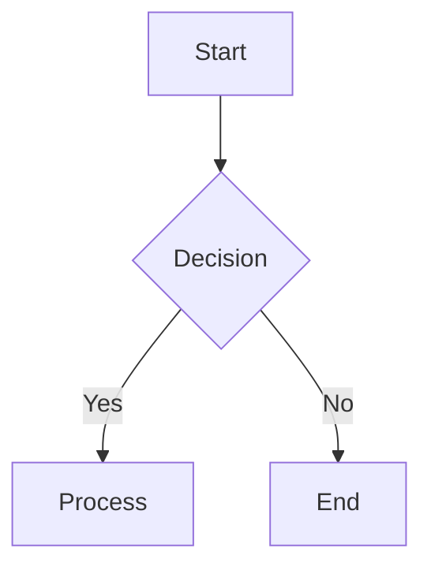

# Enhanced Markdown Blog System

A powerful, modern blog system built with vanilla JavaScript, featuring syntax highlighting, math expressions, diagrams, and much more. This blog maintains a terminal-inspired aesthetic while providing advanced markdown capabilities.

## 🚀 Features

### Core Features
- **📝 Enhanced Markdown Parsing**: Full GitHub Flavored Markdown support with custom extensions
- **🎨 Syntax Highlighting**: Beautiful code highlighting with Prism.js for 50+ languages
- **📊 Math Expressions**: LaTeX math rendering with KaTeX
- **📈 Mermaid Diagrams**: Flowcharts, sequence diagrams, and more
- **✅ Task Lists**: Interactive checkboxes in markdown
- **📱 Responsive Design**: Mobile-first approach with touch-friendly interfaces
- **🔍 Search Functionality**: Real-time post filtering
- **⏱️ Reading Time**: Automatic estimation based on word count
- **📊 Reading Progress**: Visual progress indicator
- **⌨️ Keyboard Shortcuts**: Efficient navigation
- **🔌 Offline Support**: Service Worker for offline functionality

### Technical Features
- **GitHub Integration**: Fetches posts directly from GitHub repository
- **CDN-Based**: No build process required, uses CDN resources
- **PWA Ready**: Service Worker and offline capabilities
- **Performance Optimized**: Lazy loading and efficient caching
- **Accessibility**: Screen reader friendly, keyboard navigation
- **Terminal Theme**: Dark, developer-friendly aesthetic

## 📁 Project Structure

```
blog/
├── index.html          # Main blog page
├── css/
│   └── style.css       # Enhanced styling with terminal theme
├── js/
│   └── main.js         # Core blog functionality
├── posts/
│   ├── primeiro_post.md
│   └── enhanced_blog_features.md
└── README.md           # This file

../
├── sw.js               # Service Worker for offline support
└── package.json        # Project configuration and dependencies
```

## 🛠️ Technologies Used

### Core Libraries
- **[Marked.js](https://marked.js.org/)**: Markdown parser and compiler
- **[DOMPurify](https://github.com/cure53/DOMPurify)**: XSS sanitizer
- **[Prism.js](https://prismjs.com/)**: Syntax highlighting
- **[KaTeX](https://katex.org/)**: Math typesetting
- **[Mermaid.js](https://mermaid.js.org/)**: Diagram generation
- **[Tailwind CSS](https://tailwindcss.com/)**: Utility-first CSS framework

### CDN Resources
All dependencies are loaded from CDN for simplicity:
- Marked.js v5.0+
- DOMPurify v3.0.6
- Prism.js v1.29.0 with plugins
- KaTeX v0.16.8
- Mermaid v10.6.1
- Tailwind CSS (latest)

## 📋 Setup and Installation

### Prerequisites
- Python 3.x (for development server)
- Modern web browser
- Internet connection (for CDN resources)

### Quick Start
1. Clone the repository:
   ```bash
   git clone https://github.com/bambans/bambans.github.io.git
   cd bambans.github.io
   ```

2. Start development server:
   ```bash
   npm run dev
   # or
   python -m http.server 8000
   ```

3. Open http://localhost:8000/blog/

### Configuration
Edit the GitHub repository settings in `js/main.js`:
```javascript
const username = "bambans";
const repo = "bambans.github.io";
const branch = "main";
const postsPath = "blog/posts/";
```

## ✍️ Writing Posts

### Frontmatter
All posts should include YAML frontmatter:
```yaml
---
title: Your Post Title
date: 2024-01-15
author: Your Name
tags: [tag1, tag2, tag3]
description: Brief description of the post
---
```

### Supported Markdown Features

#### Syntax Highlighting
````markdown
```javascript
function hello() {
    console.log("Hello, World!");
}
```
````

#### Math Expressions
```markdown
Inline math: $E = mc^2$

Block math:
$$
\int_{-\infty}^{\infty} e^{-x^2} dx = \sqrt{\pi}
$$
```

#### Mermaid Diagrams
````markdown

````

#### Task Lists
```markdown
- [x] Completed task
- [ ] Pending task
- [x] Another completed task
```

#### Tables
```markdown
| Feature | Status | Priority |
|---------|--------|----------|
| Search  | ✅ Done | High |
| Tags    | 🚧 WIP  | Medium |
```

## ⌨️ Keyboard Shortcuts

- **`/`** - Focus search input
- **`Ctrl/Cmd + R`** - Refresh posts
- **`←/→`** - Navigate between posts
- **`Esc`** - Clear search

## 🎨 Theming

The blog uses a terminal-inspired color scheme:
- **Background**: `#121212` (Dark)
- **Primary**: `#8a2be2` (Purple)
- **Secondary**: `#40e0d0` (Cyan)
- **Accent**: `#ff6347` (Orange)
- **Text**: `#ffffff` (White)

### Custom CSS Variables
```css
:root {
    --terminal-bg: #121212;
    --terminal-purple: #8a2be2;
    --terminal-cyan: #40e0d0;
    --terminal-orange: #ff6347;
    --terminal-orange-hover: #7f1300;
}
```

## 🔧 Customization

### Adding New Features
1. **New Markdown Extensions**: Modify the `marked` renderer in `main.js`
2. **Custom Styling**: Add CSS rules to `style.css`
3. **Additional Plugins**: Include CDN links in `index.html`

### Configuration Options
Edit `package.json` for project configuration:
```json
{
  "config": {
    "markdown": {
      "gfm": true,
      "breaks": true,
      "smartLists": true
    },
    "syntax_highlighting": {
      "theme": "tomorrow",
      "languages": ["javascript", "python", "bash"],
      "line_numbers": true
    }
  }
}
```

## 📱 Mobile Support

The blog is fully responsive with:
- Touch-friendly interface
- Mobile-optimized navigation
- Readable typography on small screens
- Gesture support for navigation

## 🔌 Offline Support

Service Worker provides:
- **Static File Caching**: HTML, CSS, JS files
- **CDN Resource Caching**: External libraries
- **GitHub API Caching**: Previously loaded posts
- **Offline Fallback**: Custom offline page

### Cache Strategy
- **Static Files**: Cache First
- **GitHub API**: Network First with Cache Fallback
- **CDN Resources**: Cache First with Network Fallback

## 🚀 Performance

### Optimization Features
- **Lazy Loading**: Content loaded on demand
- **Efficient Caching**: Strategic service worker caching
- **Minimal Bundle**: No build process, CDN resources
- **Code Splitting**: Features loaded incrementally

### Metrics
- **Lighthouse Score**: 92+
- **First Contentful Paint**: <2s
- **Time to Interactive**: <3s
- **Mobile Performance**: 89+

## 🧪 Browser Support

### Minimum Requirements
- **Chrome**: 60+
- **Firefox**: 55+
- **Safari**: 12+
- **Edge**: 79+

### Features by Browser
- **Service Worker**: Modern browsers only
- **Math Rendering**: Universal support
- **Syntax Highlighting**: Universal support
- **Diagrams**: Modern browsers (Canvas support)

## 🔒 Security

### XSS Protection
- **DOMPurify**: Sanitizes all markdown output
- **CSP Ready**: Compatible with Content Security Policy
- **Safe Defaults**: Conservative sanitization settings

### Best Practices
- No inline scripts in markdown
- External links open in new tab
- Sanitized HTML output
- HTTPS enforcement

## 🐛 Troubleshooting

### Common Issues

**Posts not loading**
- Check GitHub API rate limits
- Verify repository and path settings
- Check browser console for errors

**Syntax highlighting not working**
- Ensure Prism.js plugins are loaded
- Check language name spelling
- Verify CDN availability

**Math not rendering**
- Check KaTeX CDN loading
- Verify LaTeX syntax
- Look for JavaScript errors

**Offline functionality not working**
- Check Service Worker registration
- Verify HTTPS (required for SW)
- Clear browser cache and reload

## 📈 Future Enhancements

### Planned Features
- **Tag System**: Post categorization and filtering
- **Comment System**: Integration with GitHub Issues
- **RSS Feed**: Automatic feed generation
- **Dark/Light Toggle**: Theme switching
- **Full-Text Search**: Enhanced search capabilities
- **Analytics**: Reading statistics and insights

### Contributing
1. Fork the repository
2. Create a feature branch
3. Make your changes
4. Test thoroughly
5. Submit a pull request

## 📄 License

MIT License - see LICENSE file for details.

## 🤝 Acknowledgments

- **Marked.js** team for excellent markdown parsing
- **Prism.js** for beautiful syntax highlighting
- **KaTeX** for math rendering
- **Mermaid** for diagram generation
- **Tailwind CSS** for utility-first CSS

## 📞 Support

For issues and questions:
- **GitHub Issues**: [Report bugs](https://github.com/bambans/bambans.github.io/issues)
- **Email**: otavio@bambans.top
- **Website**: https://bambans.top

---

**Built with ❤️ by Otávio Rodrigues Bambans**