# Mermaid Charts and Diagrams Showcase

This post demonstrates all the different types of charts and diagrams you can create using Mermaid.js in the blog. Each diagram includes interactive controls for copying and fullscreen viewing.

## Table of Contents
- [Flowcharts](#flowcharts)
- [Sequence Diagrams](#sequence-diagrams)
- [Gantt Charts](#gantt-charts)
- [Pie Charts](#pie-charts)
- [Git Graphs](#git-graphs)
- [State Diagrams](#state-diagrams)
- [Journey Maps](#journey-maps)
- [Class Diagrams](#class-diagrams)
- [Entity Relationship Diagrams](#entity-relationship-diagrams)

## Flowcharts

### Basic Flowchart
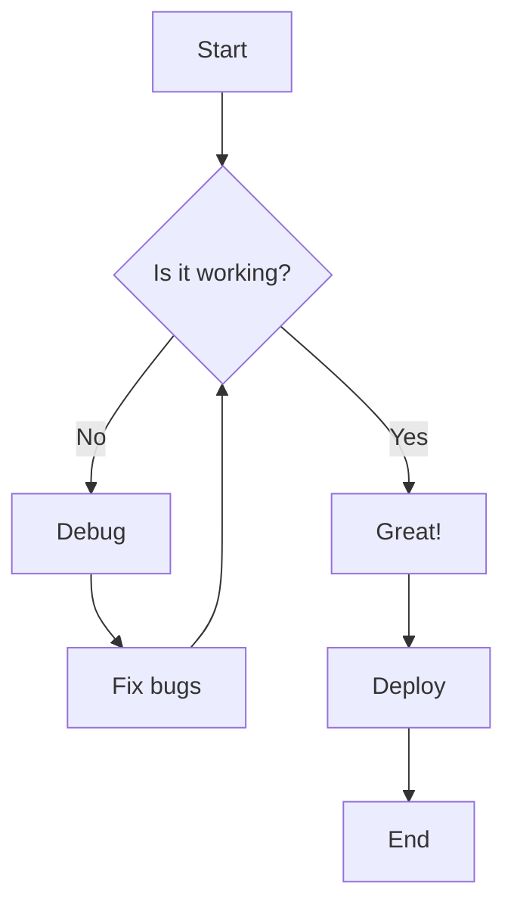

### Advanced Flowchart with Styling
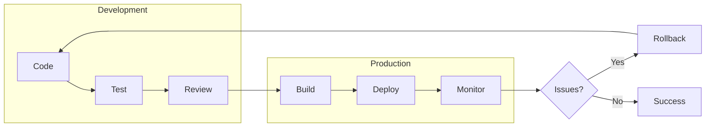

### Complex System Architecture
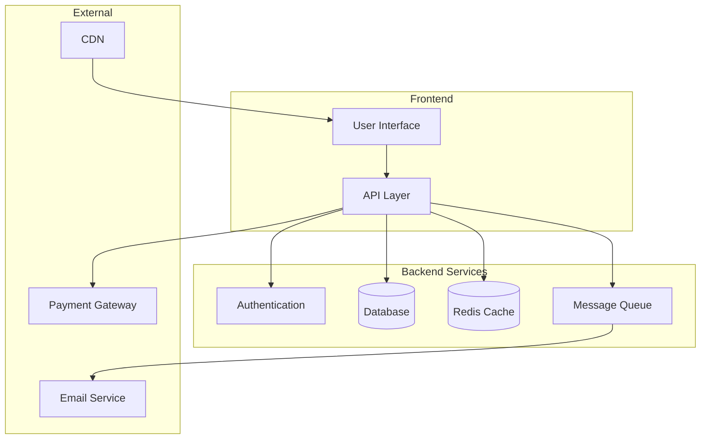

## Sequence Diagrams

### API Request Flow
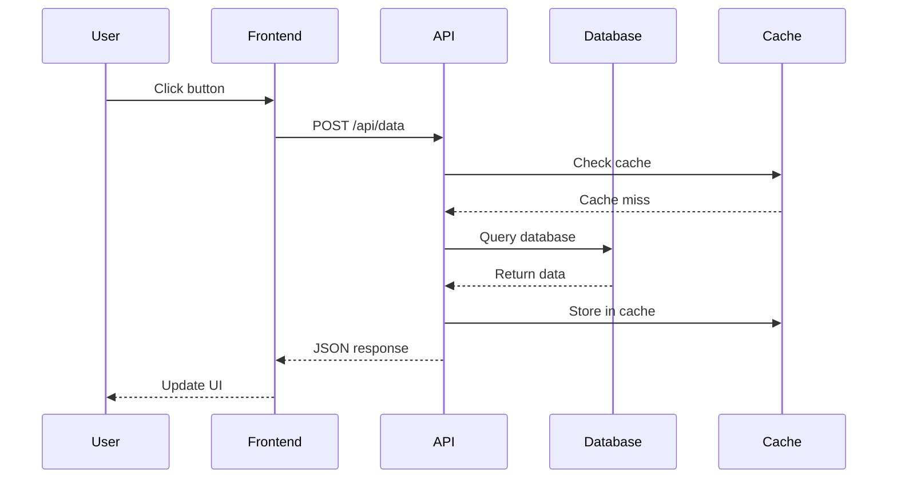

### Authentication Flow
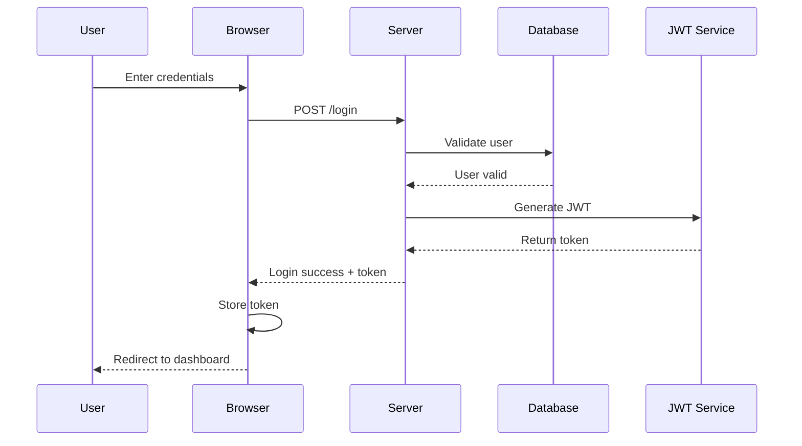

## Gantt Charts

### Project Timeline
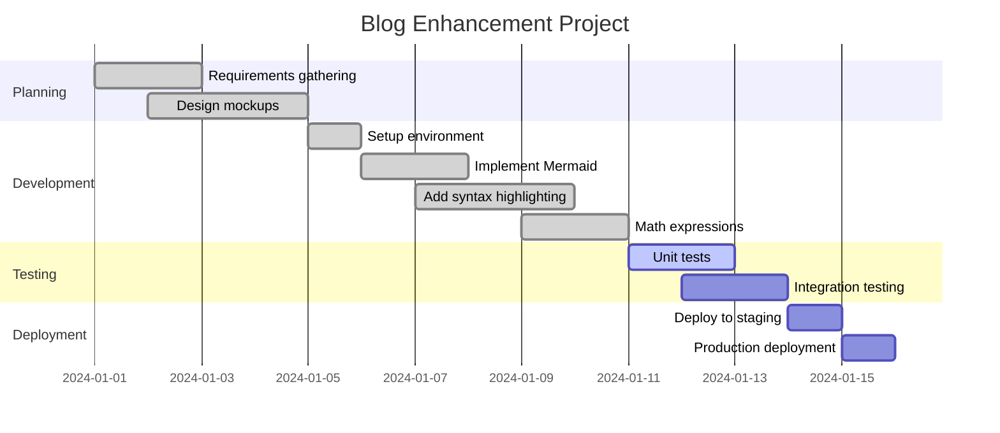

### Development Roadmap
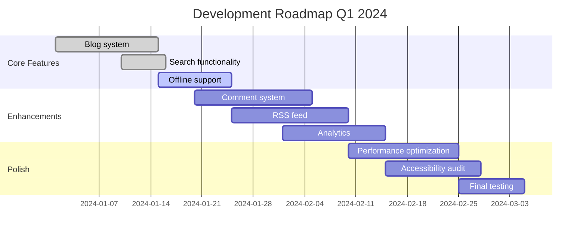

## Pie Charts

### Technology Stack Distribution
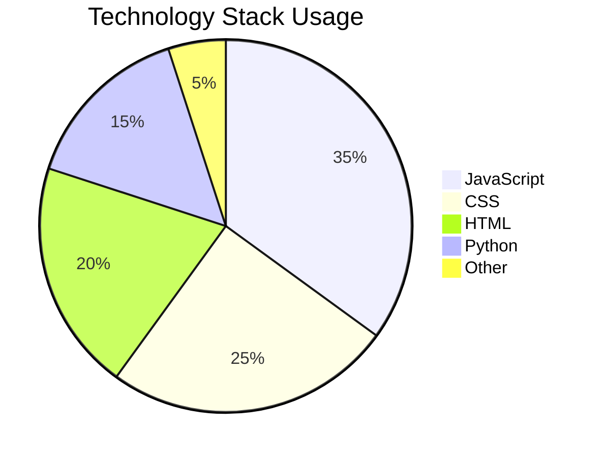

### Blog Post Categories
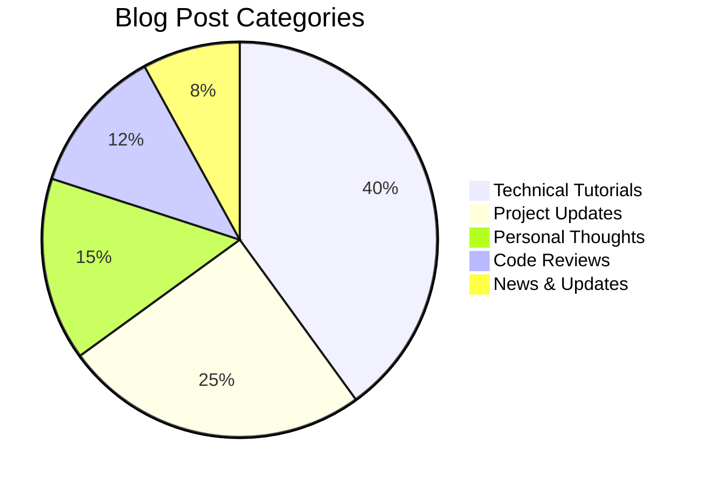

### Time Spent on Features
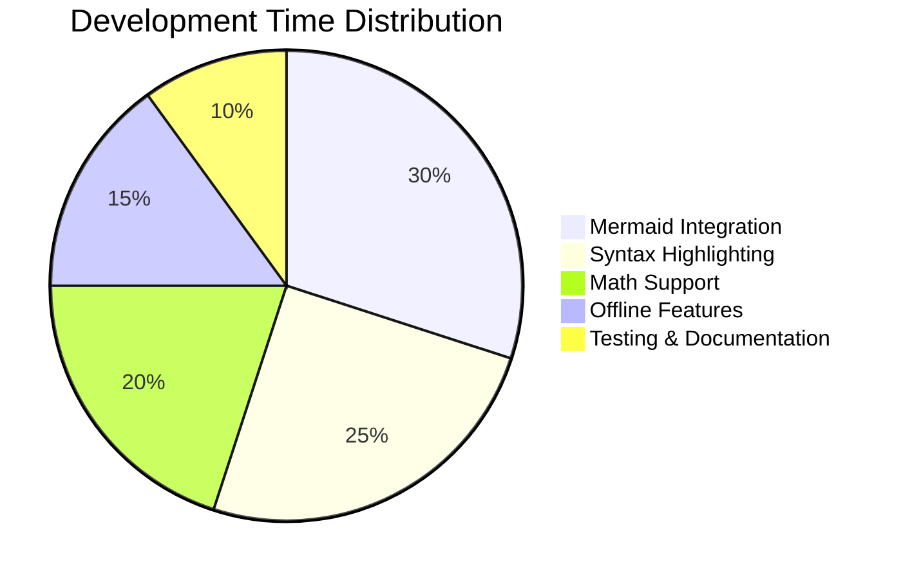

## Git Graphs

### Feature Branch Workflow
```mermaid
gitgraph
    commit id: "Initial commit"
    commit id: "Add basic blog"
    branch feature/mermaid
    checkout feature/mermaid
    commit id: "Add Mermaid.js"
    commit id: "Enhance charts"
    checkout main
    commit id: "Fix bug"
    merge feature/mermaid
    commit id: "Update documentation"
    branch feature/search
    checkout feature/search
    commit id: "Add search functionality"
    checkout main
    merge feature/search
    commit id: "Release v2.1.0"
```

## State Diagrams

### Blog Post Lifecycle
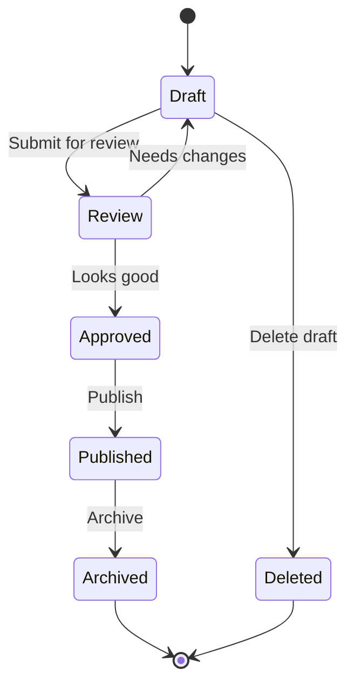

### User Authentication States
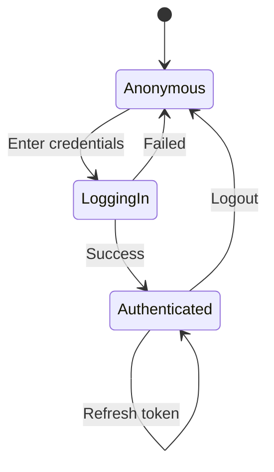

## Journey Maps

### User Blog Reading Experience
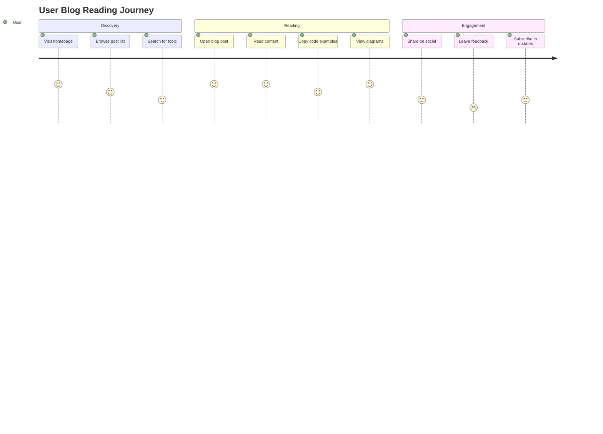

### Developer Experience Journey
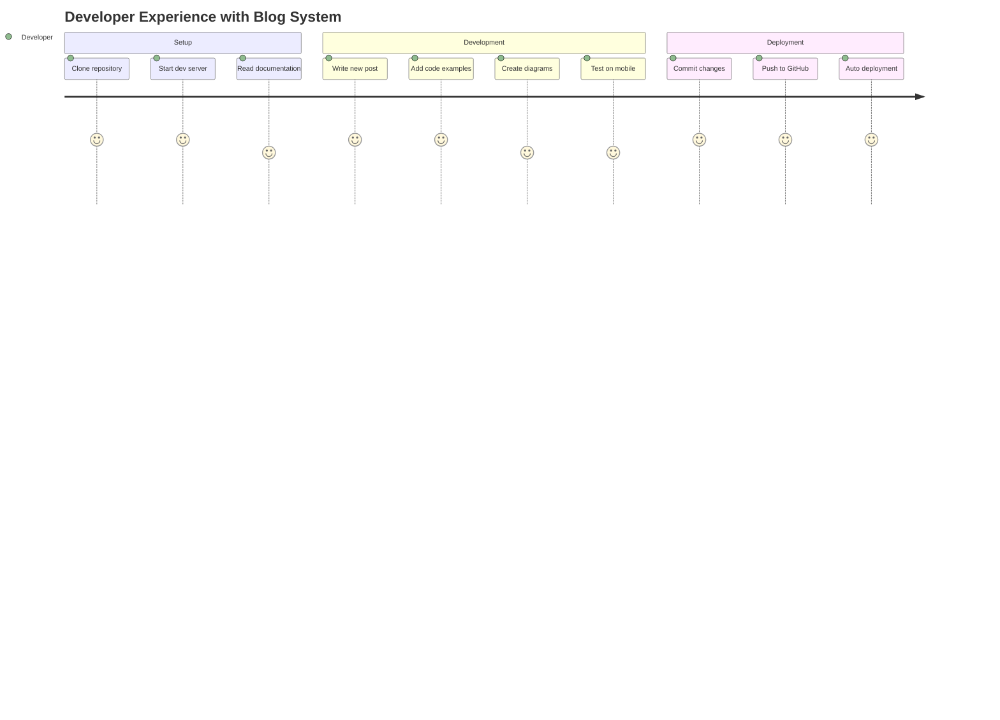

## Class Diagrams

### Blog System Architecture
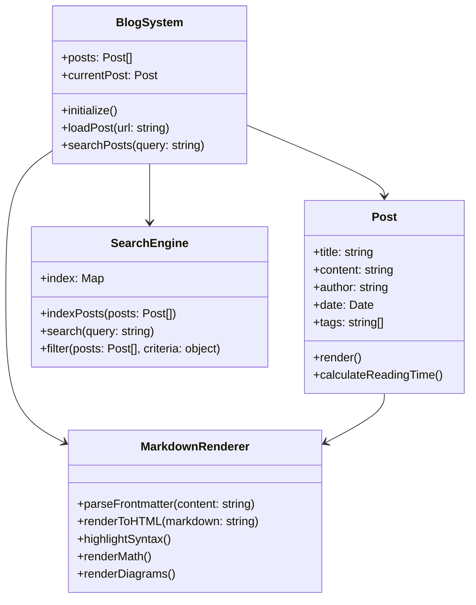

## Entity Relationship Diagrams

### Blog Database Schema
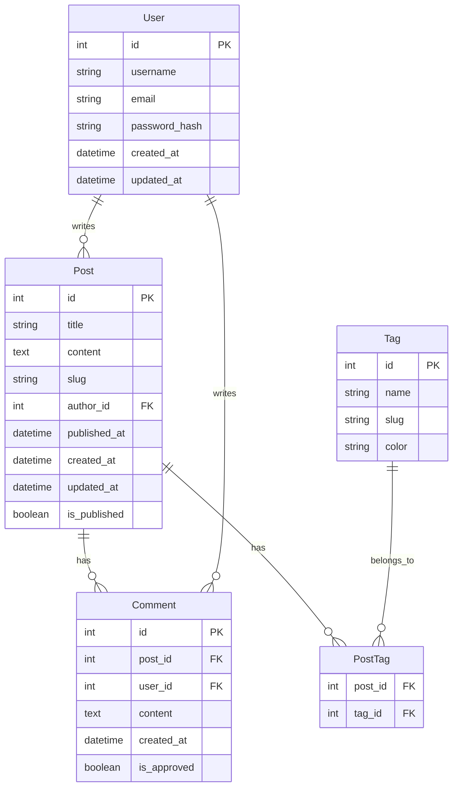

## Interactive Features

Each Mermaid diagram includes:

- **📋 Copy Code**: Click to copy the Mermaid source code
- **🔍 Fullscreen**: View diagrams in fullscreen mode
- **Responsive Design**: Diagrams adapt to different screen sizes
- **Terminal Theme**: Dark theme matching the blog aesthetic

## Creating Your Own Diagrams

To add Mermaid diagrams to your posts, use the following syntax:

````markdown
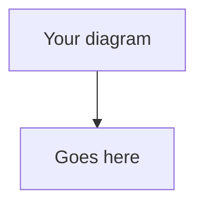
````

### Supported Diagram Types

1. **Flowcharts**: `flowchart` or `graph`
2. **Sequence Diagrams**: `sequenceDiagram`
3. **Gantt Charts**: `gantt`
4. **Pie Charts**: `pie`
5. **Git Graphs**: `gitgraph`
6. **State Diagrams**: `stateDiagram-v2`
7. **User Journey**: `journey`
8. **Class Diagrams**: `classDiagram`
9. **ER Diagrams**: `erDiagram`

## Tips for Better Diagrams

- **Keep it simple**: Don't overcrowd diagrams
- **Use descriptive labels**: Make diagrams self-explanatory
- **Consistent styling**: Stick to the terminal color scheme
- **Test responsiveness**: Ensure diagrams work on mobile
- **Add context**: Include explanatory text around diagrams

## Conclusion

Mermaid.js integration brings powerful visualization capabilities to the blog, making it perfect for technical documentation, project planning, and system architecture discussions. The charts automatically adapt to the terminal theme and provide interactive features for better user experience.

Try creating your own diagrams using the examples above as templates! 📊🚀